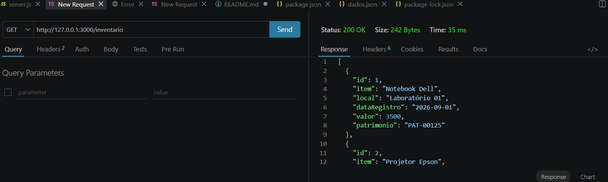
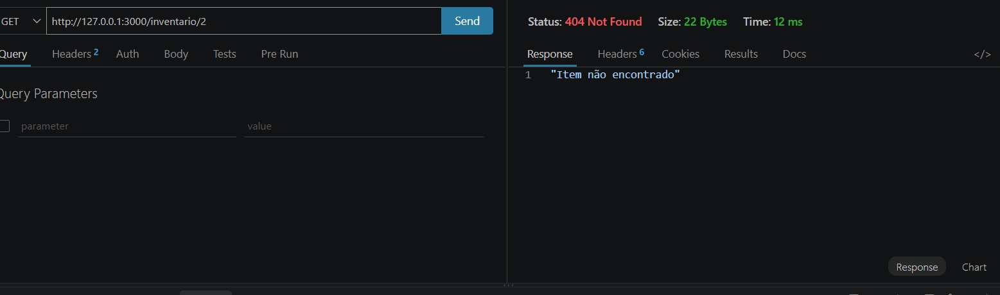
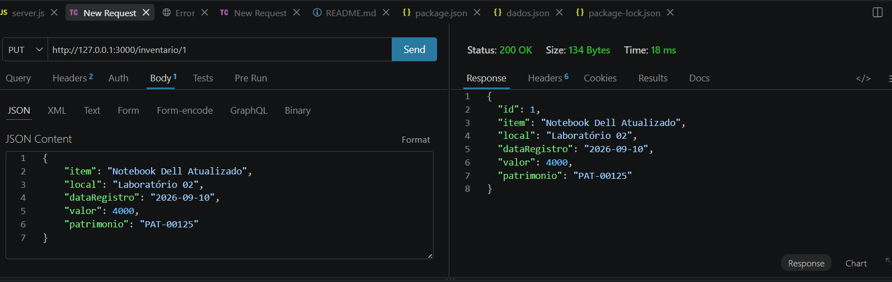
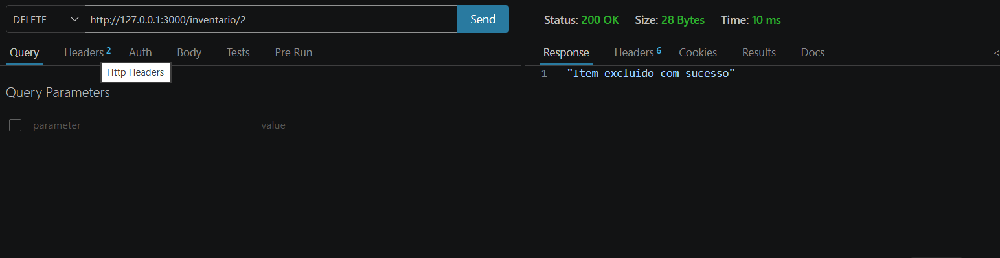

** Inventário pbe1_aula_05 **

## Sobre o Projeto 
Esse projeto foi feito para ajudar no controle dos itens de patrimônio de uma empresa.
A aplicação permite cadastrar, consultar, atualizar e excluir itens do inventário.
Os dados são armazenados em um arquivo JSON e o sistema funciona através de uma API REST.

## Tecnologias ultilizadas 
* JavaScript;
* Node.js;
* Express;
* JSON;

## Como instalar 
Primeiro abra o terminal na pasta do projeto e use:
* bash;
* npm install;

## Como iniciar
Depois de instalar use:
* bash;
* npm run dev;

O servidor vai ficar disponível em:
text
http://127.0.0.1:3000

## Dados do inventário
Cada item possui:
* id;
* item;
* local;
* dataRegistro;
* valor;
* patrimonio;

## Rotas principais

### Cadastrar um item
text
POST /inventario

Exemplo:

json 
{ 
    "item": "Notebook Dell", 
    "local": "Laboratório 01", 
    "dataRegistro": "2026-09-10", 
    "valor": 3500, 
    "patrimonio": "PAT-00125" 
} 

### Mostrar todos os itens
text
GET /inventario

### Mostrar um item pelo ID
text
GET /inventario/1

### Atualizar um item
text
PUT /inventario/1

### Excluir um item
text
DELETE /inventario/2

## Rotas extras
Também foram feitas algumas funções extras:

text
 GET /inventario/buscar?nome=Notebook 
GET /inventario/local?local=Laboratório 
GET /inventario/acima?valor=3000 
GET /inventario/patrimonio?patrimonio=PAT-00125 
GET /inventario/total 

Essas rotas servem para pesquisar itens, filtrar por local, mostrar itens acima de determinado valor, verificar patrimônio e mostrar o valor total do inventário.

## Códigos usados
* 200 - requisição realizada com sucesso
* 201 - item cadastrado
* 404 - item não encontrado

## Testes
Foram realizados testes nas rotas de cadastro, consulta, alteração e exclusão dos itens, verificando se a API estava funcionando corretamente.

[def]: ./img/put.png